<!--
  Profile README for github.com/ManishCode4u/ManishCode4u
  Keep the ./assets folder next to this file (banner, snapshot, section headers, project cards).
  Search this file for "TODO" to find the placeholders you need to replace.
-->

<div align="center">


<br/>

<a href="https://github.com/ManishCode4u"></a>
&nbsp;
<a href="https://www.linkedin.com/in/manishguptajob"></a>
&nbsp;
<a href="mailto:manish12643@gmail.com"></a>
&nbsp;
<a href="https://infozatech.com"></a>
<!-- TODO (optional): add a Portfolio button here once you have a personal portfolio URL.
&nbsp;
<a href="https://YOUR-PORTFOLIO-URL"></a>
-->

<br/><br/>

<sub>
<a href="#snapshot">Snapshot</a> &nbsp;·&nbsp;
<a href="#about">About</a> &nbsp;·&nbsp;
<a href="#stack">Stack</a> &nbsp;·&nbsp;
<a href="#matrix">Skill Matrix</a> &nbsp;·&nbsp;
<a href="#projects">Projects</a> &nbsp;·&nbsp;
<a href="#experience">Experience</a> &nbsp;·&nbsp;
<a href="#education">Education</a> &nbsp;·&nbsp;
<a href="#certifications">Certifications</a> &nbsp;·&nbsp;
<a href="#achievements">Achievements</a> &nbsp;·&nbsp;
<a href="#analytics">Analytics</a> &nbsp;·&nbsp;
<a href="#focus">Focus</a> &nbsp;·&nbsp;
<a href="#roadmap">Roadmap</a> &nbsp;·&nbsp;
<a href="#connect">Contact</a>
</sub>

<br/><br/>

<p align="center">
Java Full Stack Developer with hands-on experience in <b>Java, Spring Boot, React.js, Node.js, Express.js, MySQL and MongoDB</b>.<br/>
5+ client websites and web applications delivered, from requirement gathering to deployment.
</p>

</div>

<br/>

<a id="snapshot"></a>
<h2>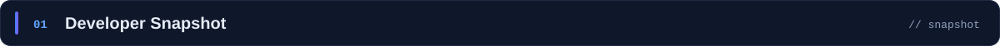</h2>

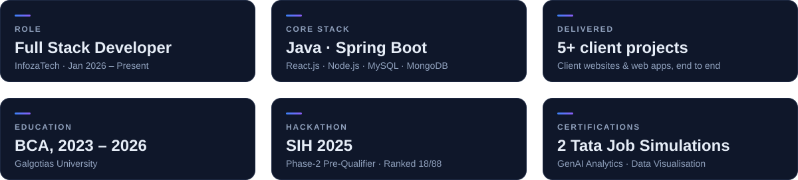

<br/>

<a id="about"></a>
<h2>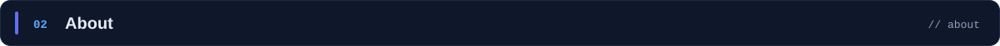</h2>

I'm a Java Full Stack Developer from Delhi with a BCA (2023–2026) from Galgotias University. Since January 2026 I've been working at [InfozaTech](https://infozatech.com), where I take client websites and web applications from requirement gathering through to deployment. I've delivered 5+ so far, and I also handle client communication, project scoping and deliverables to keep work on schedule.

On the backend I work with Java and Spring Boot, and with Node.js and Express.js on MERN projects. I design REST APIs with the right HTTP methods, status codes and error handling, and I've implemented JWT authentication and role-based access control. On the frontend it's React.js: responsive interfaces wired to those APIs, plus a reusable component library that speeds up repeat client work.

Outside client work I build my own projects, including a ride-booking concept, a platform that connects food donors with NGOs, and a gesture-recognition system for my final-year project. I keep a clean commit history and branch structure across all of them with Git and GitHub. I'm looking for a full-time Java Full Stack Developer role.

<br/>

<a id="stack"></a>
<h2></h2>

<table>
  <tr>
    <td width="18%" valign="middle"><b>Languages</b></td>
    <td>
      
      
      
    </td>
  </tr>
  <tr>
    <td valign="middle"><b>Backend</b></td>
    <td>
      
      
      
      
      
      
    </td>
  </tr>
  <tr>
    <td valign="middle"><b>Frontend</b></td>
    <td>
      
      
      
      
    </td>
  </tr>
  <tr>
    <td valign="middle"><b>Databases</b></td>
    <td>
      
      
      
    </td>
  </tr>
  <tr>
    <td valign="middle"><b>Tools &amp; Cloud</b></td>
    <td>
      
      
      
      
      
      
      
      
      
    </td>
  </tr>
  <tr>
    <td valign="middle"><b>AI Tools</b></td>
    <td>
      
      
      
      
      
    </td>
  </tr>
</table>

<details>
<summary><b>How the MERN projects fit together</b> &nbsp;<sub>(click to expand)</sub></summary>
<br/>

```text
MERN projects

  React.js UI  ───▶  Node.js + Express.js REST API  ───▶  MongoDB
                       │
                       └─ JWT authentication · role-based access control
                          CRUD · API integration · HTTP methods, status codes, error handling
```

</details>

<br/>

<a id="matrix"></a>
<h2></h2>

<table>
  <tr>
    <th align="left" width="16%">Area</th>
    <th align="left" width="46%">What I work with</th>
    <th align="left">Where it shows up</th>
  </tr>
  <tr>
    <td><b>Languages</b></td>
    <td>Java (Core Java, OOP, Collections, Exception Handling, Multithreading basics) · C · Python (basic)</td>
    <td>Six Java applications, from a calculator and games to a student notification system</td>
  </tr>
  <tr>
    <td><b>Backend</b></td>
    <td>Spring Boot · Node.js · Express.js · REST APIs · JDBC · JWT Authentication · Role-Based Access Control</td>
    <td>REST APIs with correct HTTP methods, status codes and error handling; JWT and role-based access control in Node.js backends</td>
  </tr>
  <tr>
    <td><b>Frontend</b></td>
    <td>React.js · HTML · CSS · Tailwind CSS · Responsive UI</td>
    <td>Responsive React.js interfaces integrated with Node.js / Express.js APIs; reusable component libraries</td>
  </tr>
  <tr>
    <td><b>Databases</b></td>
    <td>MySQL · SQL · MongoDB</td>
    <td>MongoDB in MERN projects covering authentication, CRUD and API integration</td>
  </tr>
  <tr>
    <td><b>Tools &amp; Cloud</b></td>
    <td>Git · GitHub · Postman · IntelliJ IDEA · Eclipse · VS Code · Antigravity · Stitch · Google Cloud Platform</td>
    <td>Clean commit history and branch management across all projects</td>
  </tr>
  <tr>
    <td><b>Core Concepts</b></td>
    <td>Data Structures &amp; Algorithms · OOP · CRUD Operations · RESTful API Design · API Integration</td>
    <td>Client applications at InfozaTech and independent MERN projects</td>
  </tr>
  <tr>
    <td><b>AI Tools</b></td>
    <td>Prompt Engineering (ChatGPT, Claude, Gemini, DeepSeek) · AI-assisted development and debugging</td>
    <td>Development and debugging workflows</td>
  </tr>
</table>

<br/>

<a id="projects"></a>
<h2>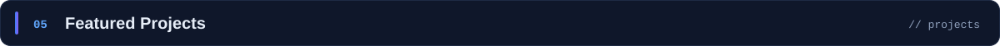</h2>

<!-- TODO: replace each REPLACE-WITH-REPO-NAME with the real repository name (the card is the link). -->
<!-- TODO (optional): if a project has a live demo, add a link under the grid, e.g. [Live demo](https://YOUR-DEMO-URL). -->
<a href="https://github.com/ManishCode4u/REPLACE-WITH-TRAVO-REPO">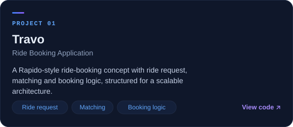</a>
<a href="https://github.com/ManishCode4u/REPLACE-WITH-GESTURE-REPO">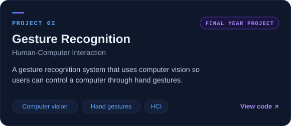</a>
<a href="https://github.com/ManishCode4u/REPLACE-WITH-FOOD-WASTE-REPO">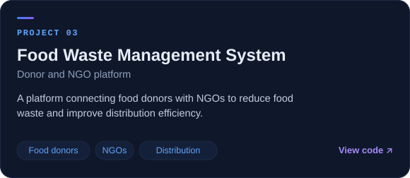</a>
<a href="https://github.com/ManishCode4u/REPLACE-WITH-JAVA-APPS-REPO">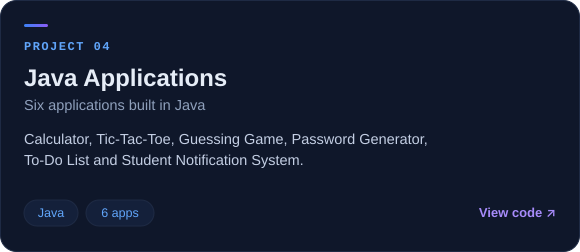</a>

<sub>Click a card to open its repository.</sub>

<br/>

<details>
<summary><b>Independent MERN projects</b> &nbsp;<sub>(click to expand)</sub></summary>
<br/>

5+ MERN projects built with React.js, Node.js, Express.js and MongoDB, covering authentication, CRUD and API integration. The Node.js backends use JWT authentication and role-based access control, and the REST APIs follow correct HTTP methods, status codes and error handling.

[Browse all repositories →](https://github.com/ManishCode4u?tab=repositories)

</details>

<br/>

<a id="experience"></a>
<h2>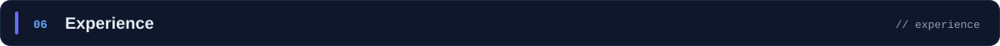</h2>

<table>
  <tr>
    <td width="20%" valign="top">
      <b>Jan 2026 – Present</b><br/>
      <sub>Delhi, India</sub>
    </td>
    <td valign="top">
      <b>Full Stack Developer</b> · <a href="https://infozatech.com">InfozaTech</a><br/>
      <ul>
        <li>Delivered 5+ client websites and web applications, owning the work from requirement gathering to deployment.</li>
        <li>Built responsive React.js interfaces integrated with Node.js and Express.js REST APIs for client applications.</li>
        <li>Developed backend systems and application logic, improving code quality and performance through debugging.</li>
        <li>Standardized reusable React component libraries to speed up project delivery across client work.</li>
        <li>Managed client communication, project scoping and deliverables to meet agreed deadlines.</li>
      </ul>
    </td>
  </tr>
  <tr>
    <td width="20%" valign="top">
      <b>Jan 2026 – Present</b><br/>
      <sub>Delhi, India</sub>
    </td>
    <td valign="top">
      <b>Full Stack Developer</b> · Independent Projects / Open Source<br/>
      <ul>
        <li>Built 5+ MERN projects (React.js, Node.js, Express.js, MongoDB) covering authentication, CRUD and API integration.</li>
        <li>Implemented JWT authentication and role-based access control in Node.js backends.</li>
        <li>Designed RESTful APIs with correct HTTP methods, status codes and error handling.</li>
        <li>Maintained clean commit history and branch management across all projects using Git and GitHub.</li>
      </ul>
    </td>
  </tr>
</table>

<br/>

<a id="education"></a>
<h2>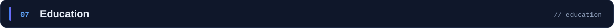</h2>

<table>
  <tr>
    <th align="left" width="20%">Duration</th>
    <th align="left" width="45%">Qualification</th>
    <th align="left">Institution</th>
  </tr>
  <tr>
    <td>2023 – 2026</td>
    <td><b>Bachelor of Computer Applications (BCA)</b></td>
    <td>Galgotias University</td>
  </tr>
  <tr>
    <td>2023</td>
    <td>Senior Secondary (12th), Science Stream</td>
    <td>Bihar School Examination Board</td>
  </tr>
  <tr>
    <td>2021</td>
    <td>Secondary (10th)</td>
    <td>Bihar School Examination Board</td>
  </tr>
</table>

<br/>

<a id="certifications"></a>
<h2>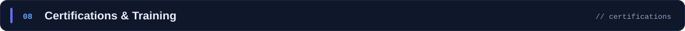</h2>

<table>
  <tr>
    <td width="50%" valign="top">
      <br/>
      <b>GenAI Powered Data Analytics</b>
    </td>
    <td width="50%" valign="top">
      <br/>
      <b>Data Visualisation: Empowering Business with Effective Insights</b>
    </td>
  </tr>
</table>

<details>
<summary><b>Internships &amp; training</b> &nbsp;<sub>(click to expand)</sub></summary>
<br/>

<table>
  <tr><td width="30%"><b>CodSoft</b></td><td>Python Development Internship</td></tr>
  <tr><td><b>Internshala</b></td><td>Java Programming</td></tr>
  <tr><td><b>EduSkills</b></td><td>Google Developer Program</td></tr>
  <tr><td><b>Great Learning</b></td><td>HTML Tags and Attributes</td></tr>
</table>

</details>

<br/>

<a id="achievements"></a>
<h2></h2>

<table>
  <tr>
    <td width="50%" valign="top">
      <br/>
      <b>Smart India Hackathon 2025</b><br/>
      Phase-2 Pre-Qualifier (MoSJE)<br/>
      Ranked 18/88 · Top 200/535 teams
    </td>
    <td width="50%" valign="top">
      <br/>
      <b>VIBETHON · SYNAPSE'25</b><br/>
      IEEE Student Branch, Galgotias University<br/>
      Participant
    </td>
  </tr>
</table>

<br/>

<a id="analytics"></a>
<h2>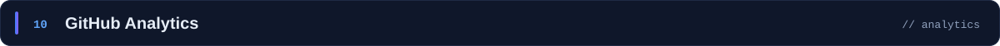</h2>

<p align="center">
  
  
</p>

<p align="center">
  
</p>

<p align="center">
  
</p>

<p align="center"><sub>Live widgets generated from public GitHub activity. The figures update automatically and are not resume claims.</sub></p>

<br/>

<a id="focus"></a>
<h2></h2>

<table>
  <tr>
    <td width="25%" valign="top"><b>Java &amp; Spring Boot</b><br/><sub>Backend applications with JDBC and MySQL</sub></td>
    <td width="25%" valign="top"><b>React.js &amp; MERN</b><br/><sub>Responsive interfaces on Node.js and Express.js APIs</sub></td>
    <td width="25%" valign="top"><b>Secure APIs</b><br/><sub>JWT authentication and role-based access control</sub></td>
    <td width="25%" valign="top"><b>Core CS</b><br/><sub>Data Structures &amp; Algorithms</sub></td>
  </tr>
</table>

<sub>Goal: a full-time Java Full Stack Developer role.</sub>

<br/><br/>

<a id="roadmap"></a>
<h2>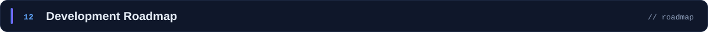</h2>

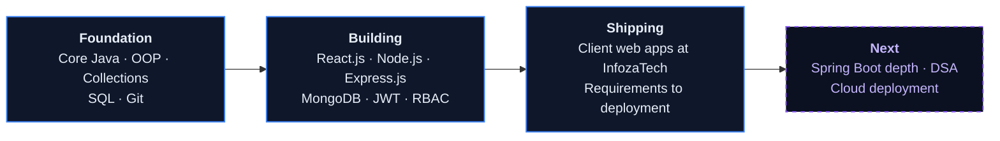

<sub>Solid outlines are work I've already done. The dashed outline is where I'm heading next.</sub>

<br/>

<a id="connect"></a>
<h2></h2>

<div align="center">

I'm looking for a full-time Java Full Stack Developer role. Email is the quickest way to reach me.

<br/><br/>

<a href="mailto:manish12643@gmail.com"></a>
<a href="https://www.linkedin.com/in/manishguptajob"></a>
<a href="https://github.com/ManishCode4u"></a>
<a href="https://infozatech.com"></a>

</div>

<br/>


<div align="center">
<sub>Manish Kumar · Java Full Stack Developer · Delhi, India &nbsp;·&nbsp; <a href="#snapshot">Back to top ↑</a></sub>
</div>
